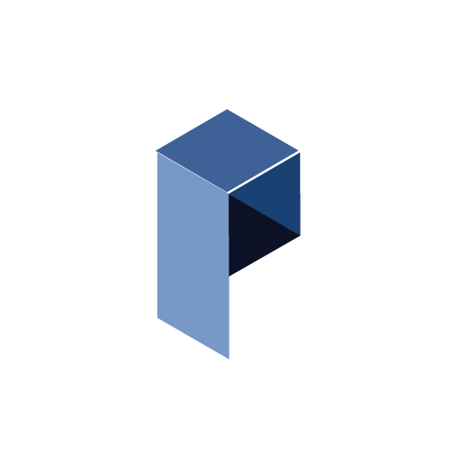
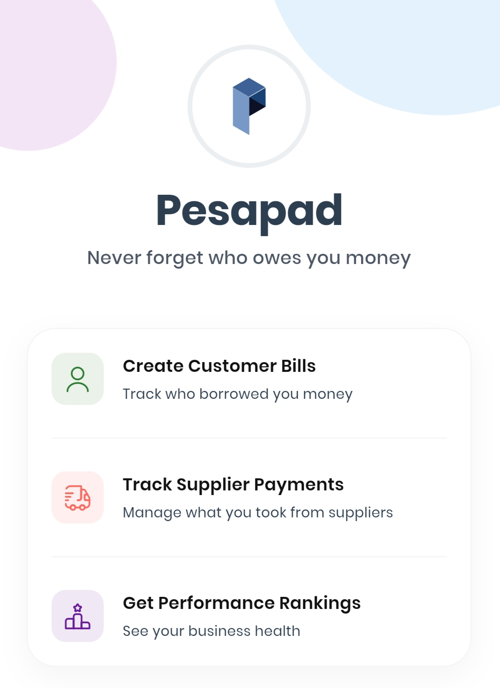

# Pesapad 📱

  
  
  ### Free Bill Tracker for Small Businesses
  
  
  
  
  
  
  **Never forget who owes you money** — Pesapad helps shop owners, vendors, and freelancers track customer bills and payments with **No Ads**. No internet needed. No monthly fees.
  
  [Features](#features) • [Demo](#demo) • [Installation](#installation) • [Support](#support) • [Creator](#creator)

---

## 📋 Table of Contents
- [About](#about)
- [Features](#features)
- [Demo](#demo)
- [Installation](#installation)
- [Tech Stack](#tech-stack)
- [Support the Project](#support-the-project)
- [Creator](#creator)
- [Contact](#contact)
- [License](#license)

---

## 💡 About

Pesapad was born from a simple observation: small businesses struggle with tracking customer debts. Paper receipts get lost, customers forget, and money remains unpaid. Other apps require expensive monthly subscriptions or constant internet connection.

Built by [Brian Mirieri Kebabe](https://briankebabe.github.io), a developer from Mombasa, Kenya, Pesapad solves these problems with a lightweight, offline-first approach that's **completely free forever**.

| ❌ The Problem | ✅ The Pesapad Solution |
|----------------|------------------------|
| "Who owes me money?" – Lost in notebooks | See all debts at a glance – Dashboard shows who owes you |
| Customers forget, you forget – money stays unpaid | Works without internet – Perfect for markets & remote shops |
| No internet in market? No records | Free forever – No ads, no subscriptions |
| Other apps need monthly subscriptions | Secure – Lock with PIN or fingerprint |

---

## ✨ Features

  

### 👥 Customer Management
- Track all customers in one place with detailed profiles
- Quick customer search
- Contact details storage

### 📝 Bill Tracking
- Create, manage, and track all bills with automatic calculations
- Send message reminders
- Add custom notes

### 📊 Payment Insights
- Visualize business finances with clear charts
- Customer performance rankings
- Payment pattern analysis

### 🔒 Security & Privacy
- **Offline First** — Works without internet, data stays on your phone
- **Secure Lock** — PIN or fingerprint protection
- **No Ads Ever** — Clean, distraction-free experience
- **Local Currencies** — Support for Kenyan Shilling and more

---

## 🎥 Demo

Watch how Pesapad transforms bill tracking in just minutes.

  
  
<em>🎬 Video coming soon — See how to add customers, create bills, and track payments</em>

---

## 📲 Installation

### Quick Download

[**⬇️ Download Pesapad APK (Android)**](https://drive.google.com/file/d/1M1ll45-DfjBjV5bp_gsf8kTxVqZUgUez/view?usp=sharing)

### App Stats

| Metric | Value |
|--------|-------|
| 📦 Size | 21MB (Lightweight) |
| 💰 Cost | $0 (Free Forever) |
| 📱 Platform | Android (iOS coming soon) |
| 🚫 Ads | None |

### Installation Guide

1. **Tap** the download button above
2. **Allow** "Install from Unknown Sources" if prompted
3. **Open** the downloaded file to install
4. **Launch** Pesapad and start tracking!

---

## 🛠️ Tech Stack

| Technology | Purpose |
|------------|---------|
| [Flutter](https://flutter.dev) | Cross-platform UI framework |
| [SQLite](https://www.sqlite.org) | Local data storage |
| [GetX](https://pub.dev/packages/get) | State management |
| [Supabase](https://supabase.com) | Backend & cloud sync |

---

## 💝 Support the Project

Pesapad is **100% free** and will remain free forever. Your support helps cover server costs, app store fees, and enables development of new features.

### Where Your Money Goes

| 🖥️ Server Costs | Supabase backend & cloud sync |
|-----------------|-------------------------------|
| 📱 App Store Fees | Google Play & future iOS store |
| 🚀 New Features | Big screen support, reports, exports |
| 🌍 Translations | Support for 100+ languages |

### Support Platforms

| Platform | Type | Fee | Link |
|----------|------|-----|------|
| **Ko-fi** | One-time donations | 0% | [Support on Ko-fi](https://ko-fi.com/pesapad) |
| **Buy Me a Coffee** | One-time or monthly | 5% | [Support on Buy Me a Coffee](https://buymeacoffee.com/pesapad) |
| **GitHub Sponsors** | Monthly sponsorships | 0% | [Sponsor on GitHub](https://github.com/sponsors/briankebabe) |

---

## 👨‍💻 Creator

  
  
  ### Brian Mirieri Kebabe
  
  **Flutter Developer & Tech Solutions Specialist**
  
  I built Pesapad after seeing my family's small shop struggle with paper receipts. As a developer from Mombasa, Kenya, I understand the real challenges local businesses face.

### Why I Built Pesapad

- ❤️ **Solving Real Problems** — Watched local shops lose money from forgotten bills. Built a solution that actually works.
- 📱 **Technology That Helps** — Used Flutter to build a fast, reliable app that works even without internet.
- 🎁 **Free For Community** — Believe essential tools should be accessible. Pesapad is free forever.

### Connect with Me

---

## 📞 Contact

- 📧 **Email:** briankebabe00@gmail.com
- 📱 **Phone:** +254 748 251 265
- 🐦 **Twitter:** [@pesapad](https://twitter.com/pesapad)
- 🌐 **Website:** [briankebabe.github.io](https://briankebabe.github.io)

---

## 📄 License

Pesapad is free software. Your business data never leaves your phone.

© 2024 Pesapad by Brian Mirieri Kebabe. All rights reserved.

---

  

    <a href="#-table-of-contents">⬆️ Back to Top</a>
  

  

    Made with ❤️ in Mombasa, Kenya
  

  

    Free forever • No ads • Privacy first
  

